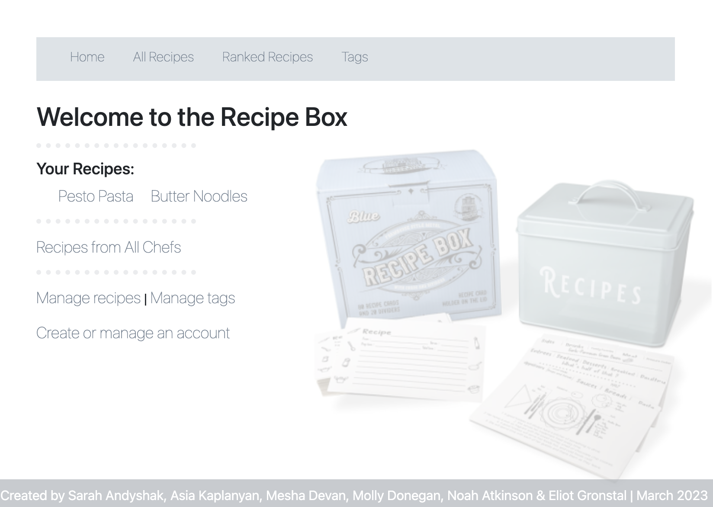

# 🍲 Recipe Box 🍲

#### By Sarah Andyshak, Asia Kaplanyan, Mesha Devan, Molly Donegan, Noah Atkinson, Eliot Gronstal

#### _A MVC app that allows users to keep track of recipes featuring authentication and authorization. Made for Week 6 of C# at Epicodus Coding School._



## 🧂 Technologies Used 🧂
 
* _C#_
* _.NET_
* _HTML_
* _MVC_
* _SQL Workbench_
* _Entity Framework_
* _CSS_

## 🧂 Description 🧂

_A MVC app that allows users to keep track of recipes featuring authentication and authorization._

* A user can add a recipe with ingredients and instructions, to remember how to prepare favorite dishes.

* A user can tag recipes with different categories, so recipes are easier to find. A recipe can have many tags and a tag can have many recipes.

* A user can update and delete tags, so they can have flexibility with how they categorize recipes.

* A user can edit recipes, so they can make improvements or corrections to recipes.

* A user can delete recipes they don't like or use, so they don't have to see them as choices.

* A user can rate recipes, so they know which ones are the best.

* A user can list recipes by highest rated so they can see which ones they like the best.

* A user can see all recipes that use a certain ingredient, so they can more easily find recipes for the ingredients they have.

* A user can add authentication:

* To create an account.
* To log in and log off.
* To be able to see my account details.

* A user should only be able to create, read, update and delete if they are logged in.

OR

* A user should only only be able to create, update and delete if they are logged in. 

* All users have read functionality.

## 🧂 Setup/Installation Requirements 🧂

* _Clone this repo._
* _Open your terminal (e.g., Terminal or GitBash) and navigate to this project's production directory called "RecipeBox"._
* _In the command line, run the command ``dotnet run`` to compile and execute the console application. Since this is a console application, you'll interact with it through text commands in your terminal._
* _Optionally, you can run ``dotnet build`` to compile this console app without running it._
* _This program was built using `Microsoft .NET SDK 6.0`, and may not be compatible with other versions._

* _If you want to run the project in production mode with a watcher, you can use a command line flag to specify that you want to run the "production" profile. ``dotnet watch run --launch-profile "production"``_
* _Open the browser to [https://localhost:5001]. If you cannot access localhost:5001 it is likely because you have not configured a .NET developer security certificate for HTTPS. To learn about this, review this lesson: [Redirecting to HTTPS and Issuing a Security Certificate.](https://www.learnhowtoprogram.com/c-and-net/basic-web-applications/redirecting-to-https-and-issuing-a-security-certificate)_

## 🧂 SQL Workbench Configuration 🧂
* _Create an `appsetting.json` file in the "Factory" directory of the project._
* _Within `appsettings.json`, put in the following code, replacing the `uid` and `pwd` values with your own username and password for MySQL._ 
```json
{
    "ConnectionStrings": {
        "DefaultConnection": "Server=localhost;Port=3306;database=recipe_box;uid=[YOUR-USERNAME-HERE];pwd=[YOUR-PASSWORD-HERE];"
    }
}
```
* _If you'd like to push this cloned project to a public-facing repository, remember to add the appsettings.json file to your .gitignore first._
* _Once "appsettings.json" file has been created, follow the below directions for Entity Framework Migration Configuration._ 

## 🧂 Entity Framework Migration Configuration 🧂

* _In root directory of project folder "RecipeBox", run `dotnet ef migrations add restoreDatabase`_
* _Then run $ `dotnet ef database update`_
* _Open SQL Workbench._
* _Navigate to `"recipe_box"` schema._
* _Click the drop down, select "Tables" drop down._
* _Verify the tables._

## 🥟 Known Bugs 🥟

* _No known bugs._

* _Please reach out with any questions or concerns_

## 🥟 License 🥟

_[MIT](https://opensource.org/license/mit/)_

Copyright (c) _2023_ _Sarah Andyshak, Asia Kaplanyan, Mesha Devan, Molly Donegan, Noah Atkinson, Eliot Gronstal_